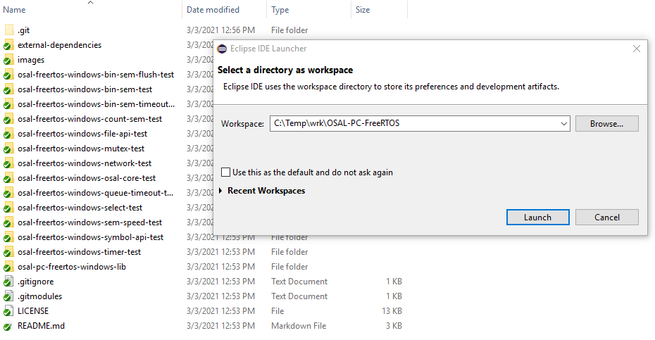

## OSAL for FreeRTOS ##
This repository contains an OSAL for FreeRTOS, specifically FreeRTOS running in the FreeRTOS Windows Simulator.
### Getting Started ###
1. The OSAL for FreeRTOS was built with MinGW-w64 from [https://sourceforge.net/projects/mingw-w64/](https://sourceforge.net/projects/mingw-w64/) using the following configuration. Newer versions should work.

	

2. Clone the OSAL for FreeRTOS and checkout the OSAL 5.0.0 compatible tag.

   `git clone https://github.com/METECS/OSAL-PC-FreeRTOS.git`

   `cd OSAL-PC-FreeRTOS/`

   `git checkout v5.0.0_compatible`

   `git submodule sync --recursive`

   `git submodule update --init --recursive`

   

6. In Eclipse, specify the OSAL for FreeRTOS location as the workspace. Eclipse version 2019-12 is being used at this time but more recent versions should work as well.

	

7. Import the projects into the Eclipse workspace.

	

8. Build the OSAL library and unit tests.

	
	
4. Run the desired unit test.

  

5. Observe the results.

   

### Limitations ###

- `OS_BinSemFlush` is not implemented. The related unit test will fail.

- `OS_IntAttachHandler`, `OS_HeapGetInfo`, `OS_chmod`, `OS_ShellOutputToFile`, `OS_chkfs`, `OS_TimeBaseCreate`, `OS_TimeBaseSet`, `OS_TimeBaseDelete`, `OS_TimeBaseGetIdByName`, `OS_TimerAdd` are not implemented.

- The file system unit tests must be modified to accommodate the requirements of FreeRTOS-FAT. Specifically, the minimum file system size is approximately 5000 blocks and the volume name must begin with a `/`.

- This OSAL does not support the networking or select functionality. As a result, the networking and select unit tests will not build.

### Future Plans ###

- If the OSAL framework is released under the Apache license, change the OSAL for FreeRTOS license to Apache. 
