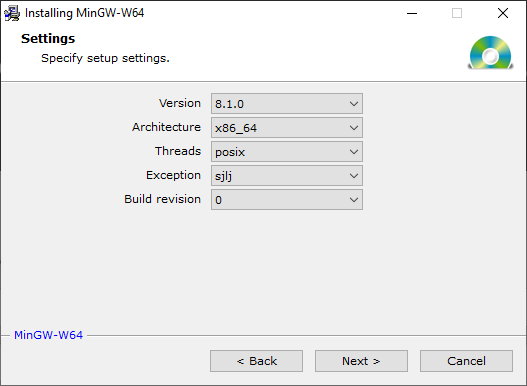

## OSAL for FreeRTOS ##
This repository contains an OSAL for FreeRTOS, specifically FreeRTOS running in the FreeRTOS Windows Simulator.
### Getting Started ###
1. The OSAL for FreeRTOS was built with MinGW-w64 from [https://sourceforge.net/projects/mingw-w64/](https://sourceforge.net/projects/mingw-w64/) using the following configuration.

	

2. In preparation for adding network connectivity, FreeRTOS is built with FreeRTOS-TCP, requiring both **Npcap**, version 0.9986 as of this writing, and **Npcap SDK**, version 1.04 as of this writing, from [https://nmap.org/npcap/](https://nmap.org/npcap/).

	

3. Clone FreeRTOS. The OSAL for FreeRTOS was built and tested against FreeRTOSv10.2.1_191129, available at [https://github.com/METECS/FreeRTOS.git](https://github.com/METECS/FreeRTOS.git).

	`cd \wrk`  
    `git clone https://github.com/METECS/FreeRTOS.git`

	

4. Clone the OSAL framework. The OSAL for FreeRTOS was built and tested against OSAL 5.0.3, available at [https://github.com/METECS/osal.git](https://github.com/METECS/osal.git).

	`cd \wrk`  
	`git clone https://github.com/METECS/osal.git`

	

5. Clone the OSAL for FreeRTOS.

	`cd \wrk`  
	`git clone https://github.com/METECS/OSAL-PC-FreeRTOS.git`

	

6. In Eclipse, version 2019-12 as of this writing, specify the OSAL for FreeRTOS location as the workspace.

	

7. In each and every project, modify the project properties to change the linked resources to point to the location of FreeRTOS and the OSAL framework.

	

	-or-

	

8. Build and run the each unit test.

	

### Limitations ###

- `OS_BinSemFlush` is not implemented. The related unit test will fail.

- `OS_IntAttachHandler`, `OS_HeapGetInfo`, `OS_chmod`, `OS_ShellOutputToFile`, `OS_chkfs`, `OS_TimeBaseCreate`, `OS_TimeBaseSet`, `OS_TimeBaseDelete`, `OS_TimeBaseGetIdByName`, `OS_TimerAdd` are not implemented.

- The file system unit tests must be modified to accommodate the requirements of FreeRTOS-FAT. Specifically, the minimum file system size is approximately 5000 blocks and the volume name must begin with a `/`.

- This current version of OSAL for FreeRTOS does not use the shared functions, found in `src\os\shared` of the OSAL framework.

### Future Plans ###

- Enhance the OSAL for FreeRTOS to use the shared functions of the OSAL framework.

- If the OSAL framework is released under the Apache license, change the OSAL for FreeRTOS license to Apache. 